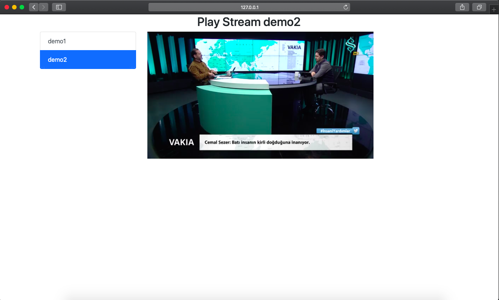

# stream-rtsp-video-to-webrtc
stream-rtsp-video-to-webrtc は、RTSP方式で受け取った画像データを、WebRTCにストリーミング配信するためのマイクロサービスです。
本マイクロサービスは、[RTSPtoWebRTC](https://github.com/deepch/RTSPtoWebRTC)を参照しています。  




### 動作環境  
* Intel/ARM CPU
* Golang Runtime

### 使用方法

1. 本レポジトリをダウンロードします。
   ```bash 
   $ git clone https://github.com/latonaio/stream-rtsp-video-to-webrtc
   ```
3. ディレクトリを移動します。
   ```bash
    $ cd stream-rtsp-video-to-webrtc/
   ```
4. 以下のコマンドでストリーミング配信が開始されます。  
   ```bash
    $ GO111MODULE=on go run *.go
   ```
